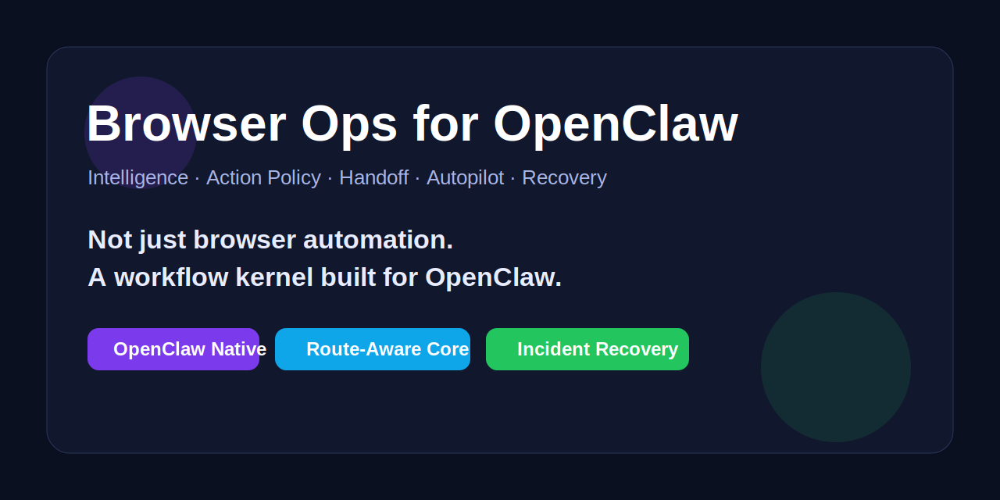

# Browser Ops for OpenClaw 🚀

<p align="center">
  
</p>

<p align="center">
  <a href="https://github.com/ly5201314gjx/browser-ops/stargazers"></a>
  <a href="https://github.com/ly5201314gjx/browser-ops/releases"></a>
  <a href="https://github.com/ly5201314gjx/browser-ops/blob/main/LICENSE"></a>
  
  
  
</p>

<p align="center">
  <b>不是又一个“会点按钮的浏览器脚本仓库”。</b><br/>
  <b>这是一个专门为 OpenClaw 打造的 Browser Operations Platform：</b><br/>
  intelligence、route selection、action policy、handoff、autopilot、failure recovery —— 全部进内核。🔥
</p>

---

## 中文介绍 🇨🇳

很多浏览器自动化项目，做到最后还是停在这几步：
- 打开页面
- 点按钮
- 抓一点数据
- 爆了就手工重来

**Browser Ops 不想停在这里。**

它要做的是一件更硬核、更像平台内核的事：

> **把浏览器任务，做成 OpenClaw 内部一个可观察、可恢复、可交接、可策略化的工作流系统。**

所以这个项目不是“几段自动化脚本”，而是一个为 **OpenClaw** 专门打造的 **Browser Operations Platform**。它把复杂浏览器任务拆成 6 层：

1. **Intelligence** — 先看懂页面，再决定怎么走
2. **Orchestration** — 用 phase + route 驱动完整工作流
3. **Action Policy** — 统一设备姿态、动作节奏、触控参数、随机扰动边界
4. **Execution** — list / detail / pagination / batch detail 真执行
5. **Handoff** — browser boundary、human-in-the-loop、handoff payload 全是一等公民
6. **Recovery** — incident registry、recovery plan、retry budget、cooldown、auto-resume hooks

这玩意的目标，不是让浏览器“勉强自动化”，而是让 OpenClaw 在浏览器任务上拥有**真正的平台级内核能力**。⚡

---

## English Intro 🇺🇸

**Browser Ops for OpenClaw** is not just another browser automation repo.

It is a browser workflow kernel designed specifically for **OpenClaw**, built around:
- page intelligence
- route-aware orchestration
- action-policy injection
- browser handoff payloads
- non-browser autopilot
- incident-aware failure recovery

The goal is simple:

> Turn browser tasks into a recoverable, inspectable, handoff-friendly, strategy-driven platform workflow.

---

## Why this hits different 💥

### Ordinary browser repos usually stop at:
- open page
- click button
- scrape data
- crash
- pray 🙃

### Browser Ops goes further:
- understand the page first 🧠
- select the right route before execution 🧭
- carry action policy into plans and runbooks 🎛️
- stop cleanly at browser boundaries ✋
- hand off to human/agent with structured payloads 📦
- recover from incidents with budgets, cooldowns, and recovery runbooks ♻️

**That difference is the whole project.**

---

## 7 个升级点，这次全上了 ✅

### 1. Hero Banner
- 已加 `docs/hero-banner.svg`
- 首页第一屏直接拉满项目气质

### 2. Quickstart Demo
- 首页增加快速体验路径
- 不废话，直接让人知道怎么跑

### 3. Bilingual README
- 中英双语，不只给中文圈看
- 更适合扩散与分享

### 4. Roadmap / Versioned Milestones
- 增加路线图与版本里程碑
- 告诉别人这不是一次性 demo

### 5. Architecture / Workflow 图
- 已补 SVG：
  - `docs/architecture.svg`
  - `docs/workflow.svg`
- 也保留文字版说明

### 6. Release v0.1.0
- 会发布首个 release
- 给仓库一个正式起点

### 7. 更炸的 About / Topics / Repo Packaging
- 重写 description
- 优化 topics
- 让仓库首页第一印象更像成熟项目

---

## Quickstart Demo ⚡

> 最适合在 **OpenClaw** 环境中使用。

### 1) 准备一个 site profile
用现成示例：
- `assets/example_profiles/hackernews-browser.json`

### 2) 初始化任务目录
```bash
python3 scripts/browser_ops_orchestrator.py init assets/example_profiles/hackernews-browser.json /tmp/browser_ops_demo 3 2 true
```

### 3) 生成 runbook
```bash
python3 scripts/browser_runbook_builder.py /tmp/browser_ops_demo
```

### 4) 自动推进非 browser 部分
```bash
python3 scripts/autopilot_tick.py /tmp/browser_ops_demo
```

### 5) 浏览器切片交接
```bash
python3 scripts/browser_handoff_payload.py /tmp/browser_ops_demo
```

### 6) 失败后恢复
```bash
python3 scripts/failure_recovery_engine.py plan /tmp/browser_ops_demo
python3 scripts/recovery_runbook_builder.py /tmp/browser_ops_demo
```

---

## 真实算法介绍（简洁版）🧠

### 1. Route Kernel
先通过 `site_intelligence.py` 分析页面，再生成 `recommendedRoute`，让 orchestrator 决定走：
- `http`
- `browser`
- `hybrid`
- `human`

### 2. Action Policy Kernel
把：
- device profile
- site profile strategy fields
- human mode
- interaction defaults / overrides

合并成 `action_policy.json`，再注入：
- `browser_plan.json`
- `runbook.json`
- `handoff_packet.json`
- `browser_handoff_payload.json`

### 3. Browser Boundary Model
遇到 browser-controlled slice 时：
- autopilot 停止推进
- 保留 `pendingBrowserSteps`
- 标记 `blockedAfterBrowser`
- 生成 handoff payload

### 4. Recovery Kernel
失败后不只记日志，而是：
- 注册 incident
- 自动分类 category
- 分配 retry budget / cooldown
- 产出 recovery plan
- 生成 recovery runbook
- 条件满足时触发 auto-resolve hook

这四个内核叠在一起，才构成 Browser Ops 的真实机制。⚙️

---

## 核心能力总览

### Site Intelligence
- classify page types
- detect checkpoints
- recommend route
- bootstrap profiles

### Intelligence-Aware Orchestrator
- phase-driven workflow
- route-aware decisions
- next-action generation

### Action Policy Layer
- device posture
- timing / motion policy
- risk tolerance
- checkpoint policy

### Human-Collab / Real-Device Mode
- handoff packet
- browser handoff payload
- browser boundary semantics
- resume flow

### Autopilot Mode
- execute non-browser glue work
- stop at browser boundary
- preserve blocked downstream steps

### Failure Recovery System
- incident registry
- recovery plan / runbook
- retry budgets
- cooldown windows
- auto-resume hooks

---

## 架构与工作流图 🗺️

- [Architecture Diagram (SVG)](docs/architecture.svg)
- [Workflow Diagram (SVG)](docs/workflow.svg)
- [Architecture Notes](docs/architecture.md)
- [Workflow Notes](docs/workflow.md)

---

## 为什么它是 OpenClaw 专用的？

因为这个项目从设计开始就不是“通用浏览器脚本合集”，而是围绕 **OpenClaw 的技能体系、runbook 模型、browser tool、human-in-the-loop、session workflow** 来构建的。

换句话说：

> **这不是把浏览器自动化硬塞进 OpenClaw。**
> **这是为 OpenClaw 原生长出来的一套浏览器工作流内核。**

这也是它最值钱的地方。🌊

---

## 安全边界 🛡️

这个项目明确不做：
- captcha bypass
- MFA / access-control bypass
- evading platform security protections
- pretending to be a human to defeat protections

碰到这些情况，正确路径永远是：
- stop
- capture artifacts
- handoff
- resume

边界感不是束缚，是平台可信度的一部分。✅

---

## Roadmap 🛣️

### v0.1.0
- intelligence-aware orchestrator
- action policy layer
- human-collab handoff
- browser boundary model
- failure recovery system

### v0.2.0
- site-specific recovery heuristics
- stronger parser overrides
- browser slice resume hooks
- richer recovery lineage

### v0.3.0
- more showcase profiles
- visual architecture dashboards
- stronger hybrid route support
- policy-aware browser execution adapters

---

## Repo Structure

```text
browser-ops/
├── SKILL.md
├── README.md
├── docs/
├── assets/
├── references/
└── scripts/
```

---

## Final Words ✨

如果你也受够了这些东西：
- 只能 demo 一次的浏览器脚本
- 一爆就只能重跑的自动化任务
- 没状态、没恢复、没交接的工作流

那你大概率会明白 Browser Ops 的方向为什么值得继续狠狠干。

**Browser Ops for OpenClaw**，不是为了“再多一个自动化仓库”。

而是为了：

> **把浏览器任务，做成真正可运行、可恢复、可交接、可进化的平台内核。**

如果这条路线也戳到你了，欢迎 ⭐ Star / Fork / Issue / Discussion。🔥🔥🔥
